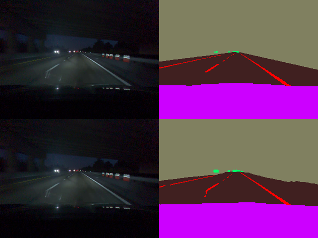
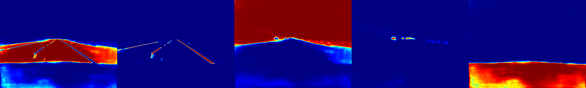

# Segnet

This project demonstrates training on the [comma10k](https://github.com/commaai/comma10k).
Goal is to provide training and prediction with Pytorch C++ "libtorch" library.
The specific network is a simple [U-Net](https://arxiv.org/abs/1505.04597) which outputs a `[N, classes, W, H]` size tensor.
To find the classification for a given pixel, the argmax of the classes responses is calculated for each and correspond to the class.

## Dependencies

* Linux only support (tested on Ubuntu 20.04 LTS)
* Pytorch Libtorch - https://pytorch.org/get-started/locally/#start-locally
  * Extract into `libtorch/` directory
  * https://download.pytorch.org/libtorch/cu101/libtorch-cxx11-abi-shared-with-deps-1.3.0.zip
  * Stable 1.3 Linux LibTorch C++
  * CUDA version 10.1
  * cxx11 ABI since we build with c++11
* Install CUDA 10.1 (match your libtorch version) - https://developer.nvidia.com/cuda-10.1-download-archive-base
* Install cuDNN 7.5 (match 10.1 cuda version!) - https://developer.nvidia.com/cudnn
* Install OpenCV - `sudo apt install libopencv-dev`
* Install Boost 1.68 - `sudo apt install libboost-dev`

## Training Yourself

- One needs to clone the [comma10k](https://github.com/commaai/comma10k) repo.
- Update the path to the root directory in the [src/net_seg_train.cpp](src/net_seg_train.cpp) file
- Build and run it
- There a bunch of augmentation applied, edit the [src/utils/augmentations.h](src/utils/augmentations.h) if you wish to tune them
- If you wish to train on a different dataset, you would need to create your own [data loader](src/data/)
- After training, you can use the [src/net_seg_test.cpp](src/net_seg_test.cpp) file to see your loss on the validation subset

## Future Work / TODOs

- Allow setting of max return prop
- See if dropout in network helps
- Compare against baseline: https://github.com/commaai/comma10k/issues/2000
- ROS subscriber / publish
- ROS append to bag file

## Some Results

Right now there are 8908 images in the [files_trainable](https://github.com/commaai/comma10k/blob/master/files_trainable) with 976 for testing.
It seems to perform ok after >20 epochs, but the fine detail seems to struggle.
Training started at 4:53pm on March 13, 2022 and reached epoch 33 at 8:55pm (7 minutes per epoch) on a 1080Ti card.
It would be interesting to perform evaluation only on "confident" network returns.

Input picture (left), groundtruth (top right), and prediction (bottom right)

Confidence in order for: Road, Lane markings, Undrivable, Movable, My car.

